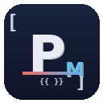
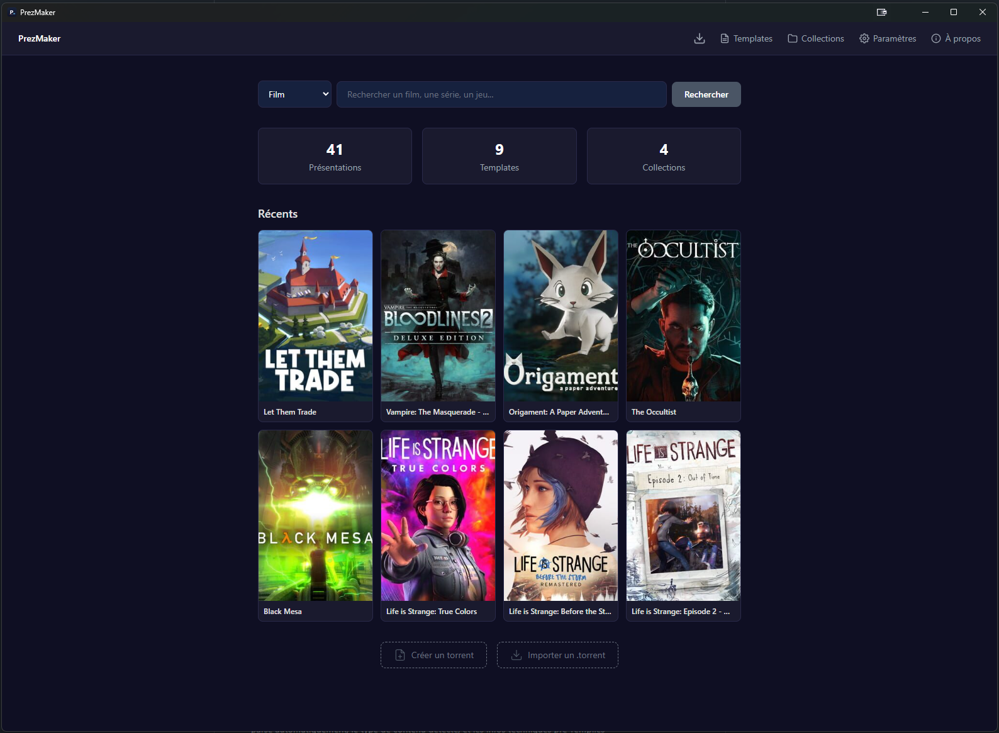
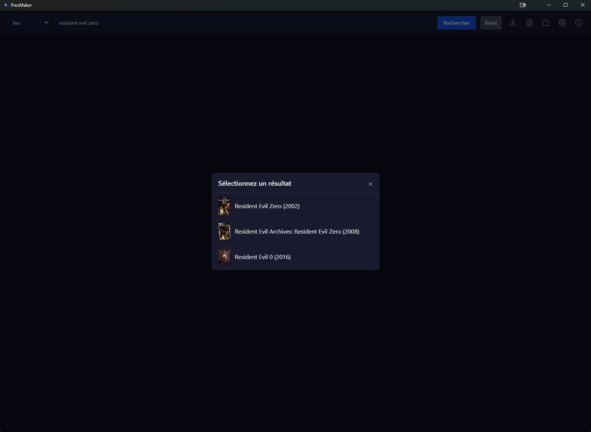
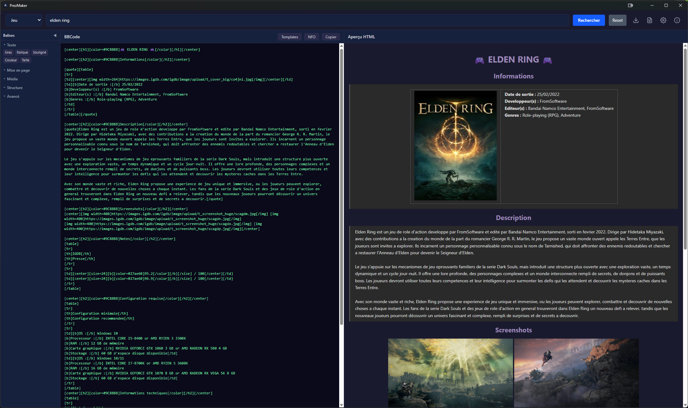
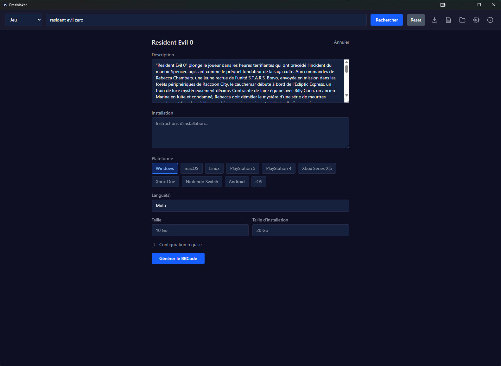
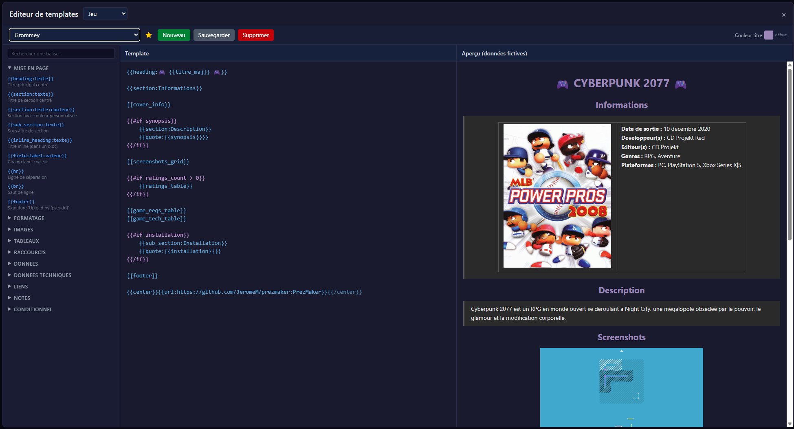
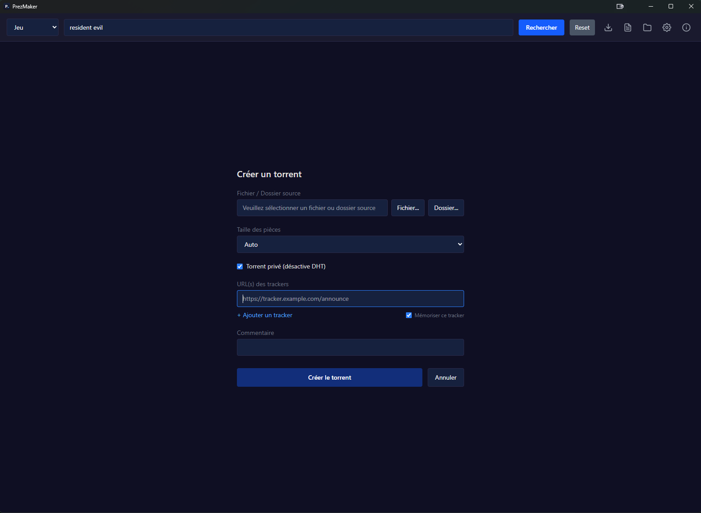
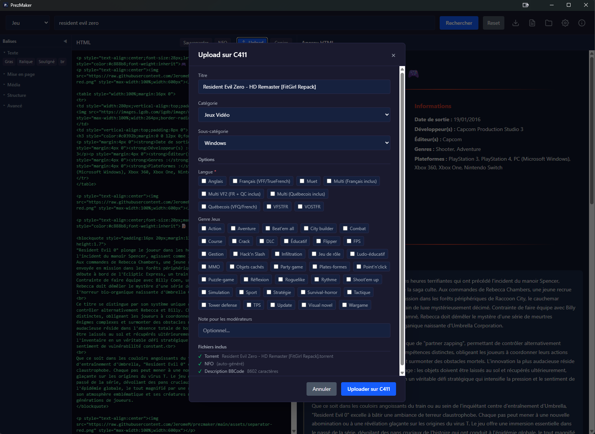
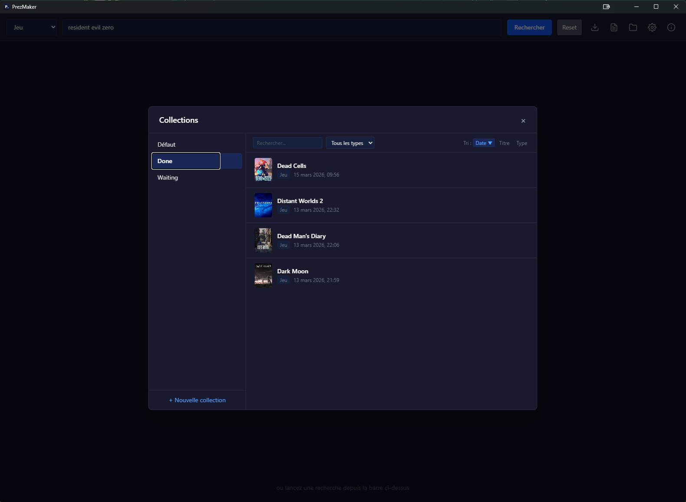
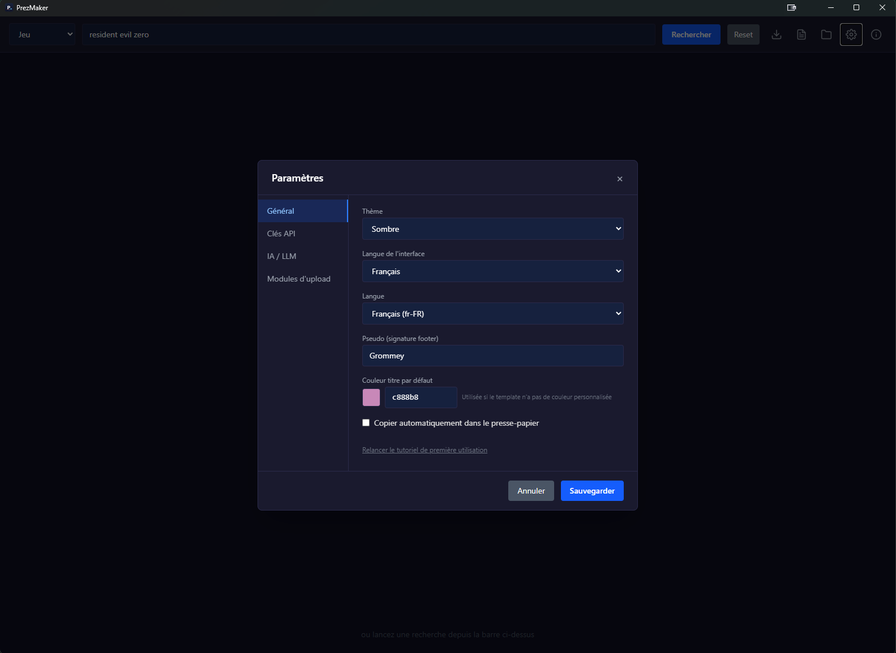

<p align="center">
  <a href="README.en.md">English</a> | Fran&ccedil;ais
</p>

<p align="center">
  
</p>

<h1 align="center">PrezMaker</h1>

<p align="center">
  <strong>Générateur de présentations BBCode et HTML pour les trackers</strong>
</p>

<p align="center">
  <a href="../../releases/latest"></a>
  <a href="https://paypal.me/grommey"></a>
  <a href="https://www.buymeacoffee.com/grommey"></a>
</p>

---

Recherchez un film, une série, un jeu ou une application, et obtenez une présentation complète formatée en BBCode ou HTML, prête à être collée sur un tracker.

<p align="center">
  
</p>

## Fonctionnalités

### Recherche et métadonnées

- **Recherche automatique** — TMDB (films/séries), IGDB et Steam (jeux), avec notes Allociné
- **Import torrent** — glissez un `.torrent` sur l'application, tout est détecté automatiquement (titre, type, infos techniques)
- **Création de torrent** — créez un `.torrent` directement depuis l'application

### Templates

- **Double format BBCode / HTML** — choisissez le format de sortie, chaque template est lié à un format
- **Éditeur intégré** — coloration syntaxique, aperçu en temps réel, balises conditionnelles, blocs composites (notes, config requise, screenshots...)
- **Template favori** — un template par défaut par type de contenu, couleur de titre personnalisable
- **Export / Import** — partagez vos templates au format JSON

### Upload C411

- **Upload direct** — envoyez sur C411 en un clic, catégorie et options pré-remplies automatiquement
- **File d'attente** — préparez plusieurs uploads et envoyez-les tous en une fois, ou programmez l'envoi à une heure précise
- **Métadonnées incluses** — données TMDB ou RAWG envoyées automatiquement avec l'upload
- **Retry** — relancez les uploads échoués, consultez les erreurs et la réponse de l'API
- **Journal** — chaque upload est journalisé dans `%APPDATA%/prezmaker/upload_log.txt`

### Collections et IA

- **Collections** — sauvegardez vos présentations avec torrent et NFO pour les retrouver plus tard
- **Description IA** — génération de descriptions et de NFO via LLM (Groq, Mistral, Gemini)

### Interface

- **Français / Anglais** — interface bilingue
- **Thème clair / sombre**
- **Mise à jour automatique** au lancement

## Screenshots

<table>
  <tr>
    <td align="center"><strong>Accueil</strong></td>
    <td align="center"><strong>Résultats de recherche</strong></td>
  </tr>
  <tr>
    <td></td>
    <td></td>
  </tr>
  <tr>
    <td align="center"><strong>Présentation générée</strong></td>
    <td align="center"><strong>Formulaire jeu</strong></td>
  </tr>
  <tr>
    <td></td>
    <td></td>
  </tr>
  <tr>
    <td align="center"><strong>Éditeur de templates</strong></td>
    <td align="center"><strong>Création de torrent</strong></td>
  </tr>
  <tr>
    <td></td>
    <td></td>
  </tr>
  <tr>
    <td align="center"><strong>Upload sur C411</strong></td>
    <td align="center"><strong>Collections</strong></td>
  </tr>
  <tr>
    <td></td>
    <td></td>
  </tr>
  <tr>
    <td align="center"><strong>Paramètres</strong></td>
    <td></td>
  </tr>
  <tr>
    <td></td>
    <td></td>
  </tr>
</table>

## Installation

Téléchargez la dernière version depuis la page [Releases](../../releases/latest) :

| Plateforme | Fichier |
|---|---|
| Windows | `.exe` (NSIS) ou `.msi` |

L'application se met à jour automatiquement au lancement lorsqu'une nouvelle version est disponible.

## Configuration

Au premier lancement, un assistant vous guide pour configurer les clés API nécessaires.

Vous pouvez aussi accéder aux paramètres à tout moment via l'icône engrenage :

| Clé | Description | Obligatoire |
|---|---|:-:|
| **TMDB API Key** | Pour rechercher films et séries | Oui |
| **IGDB Client ID / Secret** | Pour rechercher des jeux | Oui (jeux) |
| **LLM Provider + API Key** | Pour les descriptions IA et la génération NFO | Non |
| **C411 API Key** | Pour l'upload direct sur C411 | Non |
| **RAWG API Key** | Pour les métadonnées jeux dans l'upload C411 | Non |
| **Pseudo** | Signature dans le footer des présentations | Non |
| **Couleur du titre** | Code couleur hex par défaut pour les titres | Non |

## Utilisation

1. Sélectionnez le type de contenu (Film, Série, Jeu, Application)
2. Tapez votre recherche ou importez un fichier `.torrent` (drag & drop ou clic)
3. Sélectionnez le bon résultat
4. Complétez les informations supplémentaires si nécessaire
5. Choisissez un template et le format de sortie (BBCode ou HTML)
6. La présentation est générée avec aperçu en temps réel
7. Copiez, éditez, sauvegardez dans une collection ou uploadez directement

## Stack technique

| Composant | Technologie |
|---|---|
| GUI | [Tauri v2](https://v2.tauri.app/) |
| Frontend | React 19 + TypeScript + Tailwind CSS v4 + Vite |
| Backend | Rust (workspace : `prezmaker-lib`, `src-tauri`) |
| APIs | TMDB, IGDB, Steam, Allociné (scraping), Groq/Mistral/Gemini (LLM), C411 |
| Tests | Vitest + React Testing Library (frontend), Rust tests (backend) |

## Build depuis les sources

### Prérequis

- [Rust](https://rustup.rs/) (stable)
- [Node.js](https://nodejs.org/) >= 20
- [Tauri CLI](https://v2.tauri.app/start/prerequisites/) : `cargo install tauri-cli --version "^2"`
- Dépendances système selon la plateforme ([voir la doc Tauri](https://v2.tauri.app/start/prerequisites/))

### Build

```bash
git clone https://github.com/JeromeM/prezmaker.git
cd prezmaker

# Installer les dépendances frontend
cd ui && npm install && cd ..

# Mode développement
cargo tauri dev

# Build production
cargo tauri build

# Lancer les tests
cargo test -p prezmaker-lib
cd ui && npm test
```

## Licence

Ce projet est distribué sous licence MIT.
